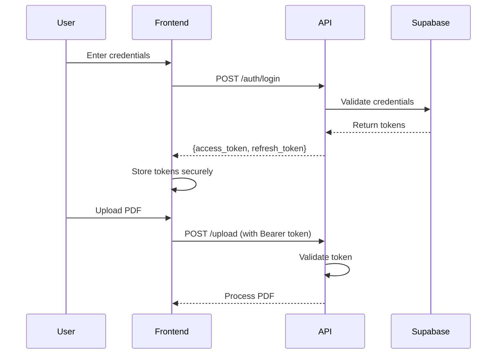

# Frontend Authentication Guide for Legal RAG API

Complete guide for integrating authentication into your frontend application.

---

## Table of Contents

1. [Authentication Flow Overview](#authentication-flow-overview)
2. [API Endpoints](#api-endpoints)
3. [Token Management](#token-management)
4. [Implementation Examples](#implementation-examples)
5. [Error Handling](#error-handling)
6. [Best Practices](#best-practices)

---

## Authentication Flow Overview



**Key Points:**
- Access tokens expire after **1 hour** (default)
- Use refresh tokens to get new access tokens without re-login
- All protected endpoints require `Authorization: Bearer <access_token>` header

---

## API Endpoints

### Base URL
```
http://localhost:8000  (development)
https://your-domain.com  (production)
```

### 1. **Sign Up** - Create New User

**Endpoint:** `POST /auth/signup`

**Request Body:**
```json
{
  "email": "user@example.com",
  "password": "your_secure_password"
}
```

**Password Requirements:**
- Minimum 8 characters
- Recommended: Mix of letters, numbers, and special characters

**Success Response (200):**
```json
{
  "access_token": "eyJhbGciOiJIUzI1NiIsInR5cCI6IkpXVCJ9...",
  "refresh_token": "eyJhbGciOiJIUzI1NiIsInR5cCI6IkpXVCJ9...",
  "token_type": "bearer",
  "expires_in": 3600
}
```

**Error Response (400):**
```json
{
  "detail": "Password must be at least 8 characters"
}
```

---

### 2. **Login** - Authenticate User

**Endpoint:** `POST /auth/login`

**Request Body:**
```json
{
  "email": "user@example.com",
  "password": "your_secure_password"
}
```

**Success Response (200):**
```json
{
  "access_token": "eyJhbGciOiJIUzI1NiIsInR5cCI6IkpXVCJ9...",
  "refresh_token": "eyJhbGciOiJIUzI1NiIsInR5cCI6IkpXVCJ9...",
  "token_type": "bearer",
  "expires_in": 3600
}
```

**Error Response (401):**
```json
{
  "detail": "Invalid email or password"
}
```

---

### 3. **Get Current User** - Verify Token

**Endpoint:** `GET /auth/me`

**Headers:**
```
Authorization: Bearer <access_token>
```

**Success Response (200):**
```json
{
  "id": "550e8400-e29b-41d4-a716-446655440000",
  "email": "user@example.com"
}
```

**Error Response (401):**
```json
{
  "detail": "Invalid or expired token"
}
```

---

### 4. **Refresh Token** - Get New Access Token

**Endpoint:** `POST /auth/refresh`

**Request Body:**
```json
{
  "refresh_token": "eyJhbGciOiJIUzI1NiIsInR5cCI6IkpXVCJ9..."
}
```

**Success Response (200):**
```json
{
  "access_token": "eyJhbGciOiJIUzI1NiIsInR5cCI6IkpXVCJ9...",
  "refresh_token": "eyJhbGciOiJIUzI1NiIsInR5cCI6IkpXVCJ9...",
  "token_type": "bearer",
  "expires_in": 3600
}
```

**Error Response (401):**
```json
{
  "detail": "Invalid or expired refresh token"
}
```

---

### 5. **Logout** - Invalidate Session

**Endpoint:** `POST /auth/logout`

**Headers:**
```
Authorization: Bearer <access_token>
```

**Success Response (200):**
```json
{
  "message": "Successfully logged out"
}
```

**Note:** Even if server logout fails, client should discard tokens.

---

### 6. **Upload PDF** (Protected)

**Endpoint:** `POST /upload`

**Headers:**
```
Authorization: Bearer <access_token>
Content-Type: multipart/form-data
```

**Request Body:**
```
file: <PDF file>
```

**Success Response - Small File (200):**
```json
{
  "message": "PDF 'contract' processed and stored successfully",
  "pdf_name": "contract",
  "cached": false,
  "chunks_processed": 45,
  "text_chunks": 38,
  "image_chunks": 7,
  "processing_duration": "12.45s",
  "status": "newly_processed"
}
```

**Success Response - Large File (200):**
```json
{
  "job_id": "550e8400-e29b-41d4-a716-446655440000",
  "message": "Large file processing started for 'contract'",
  "status": "started",
  "requires_polling": true,
  "check_status_url": "/status/550e8400-e29b-41d4-a716-446655440000",
  "file_size_mb": "12.5"
}
```

**Error Response (401):**
```json
{
  "detail": "Invalid or expired token"
}
```

**Error Response (400):**
```json
{
  "detail": "PDF 'contract' already uploaded. Please use a different name or delete the existing one first."
}
```

---

### 7. **Check Upload Status** (Protected)

**Endpoint:** `GET /status/{job_id}`

**Headers:**
```
Authorization: Bearer <access_token>
```

**Success Response (200):**
```json
{
  "job_id": "550e8400-e29b-41d4-a716-446655440000",
  "pdf_name": "contract",
  "filename": "contract.pdf",
  "status": "processing",
  "stage": "Captioning 15 images",
  "progress": 0.6,
  "start_time": "2024-01-15T10:30:00Z",
  "elapsed_time": "45.2s"
}
```

**Completed Response (200):**
```json
{
  "job_id": "550e8400-e29b-41d4-a716-446655440000",
  "status": "completed",
  "stage": "Completed",
  "progress": 1.0,
  "result": {
    "message": "PDF 'contract' processed successfully",
    "pdf_name": "contract",
    "chunks_processed": 45
  }
}
```

---

### 8. **Query PDFs** (Protected)

**Endpoint:** `POST /query`

**Headers:**
```
Authorization: Bearer <access_token>
Content-Type: application/json
```

**Request Body:**
```json
{
  "query": "What are the payment terms?",
  "pdf_name": "contract"  // Optional: limit to specific PDF
}
```

**Optional Query Parameter:**
```
?conversation_id=uuid  // Continue existing conversation
```

**Success Response (200):**
```json
{
  "conversation_id": "660e8400-e29b-41d4-a716-446655440000",
  "answer": "The payment terms are Net 30 days from invoice date...",
  "images": [
    {
      "url": "https://storage.blob.core.windows.net/...",
      "page": 5,
      "caption": "Payment schedule table showing monthly installments"
    }
  ],
  "sources": [
    {
      "type": "text",
      "page": 4,
      "content_preview": "Payment shall be made within thirty (30) days..."
    },
    {
      "type": "image",
      "page": 5,
      "content_preview": "Payment schedule table showing monthly installments"
    }
  ]
}
```

---

## Token Management

### 1. **Storing Tokens Securely**

#### Option A: localStorage (Simpler, less secure)
```javascript
// Store tokens after login
localStorage.setItem('access_token', response.access_token);
localStorage.setItem('refresh_token', response.refresh_token);
localStorage.setItem('token_expiry', Date.now() + response.expires_in * 1000);

// Retrieve token
const accessToken = localStorage.getItem('access_token');

// Clear tokens on logout
localStorage.removeItem('access_token');
localStorage.removeItem('refresh_token');
localStorage.removeItem('token_expiry');
```

**⚠️ Note:** Vulnerable to XSS attacks. Only use for low-security apps.

#### Option B: httpOnly Cookies (More secure - requires backend proxy)
```javascript
// Backend sets httpOnly cookie after login
// No JavaScript access to token
// Automatically sent with requests to same domain
```

**✅ Recommended:** Requires backend proxy to set cookies.

#### Option C: Memory + Session Storage (Balanced)
```javascript
// Store in memory (lost on refresh)
let accessToken = response.access_token;

// Store refresh token in sessionStorage (lost on tab close)
sessionStorage.setItem('refresh_token', response.refresh_token);
```

---

### 2. **Token Refresh Strategy**

#### Automatic Token Refresh
```javascript
// Check if token is about to expire
function isTokenExpiring() {
  const expiry = localStorage.getItem('token_expiry');
  const now = Date.now();
  const timeLeft = expiry - now;

  // Refresh if less than 5 minutes left
  return timeLeft < 5 * 60 * 1000;
}

// Refresh token before making request
async function getValidAccessToken() {
  if (isTokenExpiring()) {
    const refreshToken = localStorage.getItem('refresh_token');

    const response = await fetch('http://localhost:8000/auth/refresh', {
      method: 'POST',
      headers: { 'Content-Type': 'application/json' },
      body: JSON.stringify({ refresh_token: refreshToken })
    });

    const data = await response.json();

    // Store new tokens
    localStorage.setItem('access_token', data.access_token);
    localStorage.setItem('refresh_token', data.refresh_token);
    localStorage.setItem('token_expiry', Date.now() + data.expires_in * 1000);

    return data.access_token;
  }

  return localStorage.getItem('access_token');
}
```

---

## Implementation Examples

### React + Axios

#### 1. **Auth Context Provider**

```javascript
// contexts/AuthContext.js
import React, { createContext, useState, useEffect } from 'react';
import axios from 'axios';

const API_URL = 'http://localhost:8000';

export const AuthContext = createContext();

export const AuthProvider = ({ children }) => {
  const [user, setUser] = useState(null);
  const [loading, setLoading] = useState(true);

  // Setup axios interceptor for automatic token injection
  useEffect(() => {
    const interceptor = axios.interceptors.request.use(
      async (config) => {
        const token = await getValidAccessToken();
        if (token) {
          config.headers.Authorization = `Bearer ${token}`;
        }
        return config;
      },
      (error) => Promise.reject(error)
    );

    return () => axios.interceptors.request.eject(interceptor);
  }, []);

  // Check if user is logged in on mount
  useEffect(() => {
    checkAuth();
  }, []);

  const checkAuth = async () => {
    const token = localStorage.getItem('access_token');

    if (!token) {
      setLoading(false);
      return;
    }

    try {
      const response = await axios.get(`${API_URL}/auth/me`, {
        headers: { Authorization: `Bearer ${token}` }
      });
      setUser(response.data);
    } catch (error) {
      // Token invalid, clear storage
      logout();
    } finally {
      setLoading(false);
    }
  };

  const signup = async (email, password) => {
    const response = await axios.post(`${API_URL}/auth/signup`, {
      email,
      password
    });

    const { access_token, refresh_token, expires_in } = response.data;

    // Store tokens
    localStorage.setItem('access_token', access_token);
    localStorage.setItem('refresh_token', refresh_token);
    localStorage.setItem('token_expiry', Date.now() + expires_in * 1000);

    // Get user info
    await checkAuth();

    return response.data;
  };

  const login = async (email, password) => {
    const response = await axios.post(`${API_URL}/auth/login`, {
      email,
      password
    });

    const { access_token, refresh_token, expires_in } = response.data;

    // Store tokens
    localStorage.setItem('access_token', access_token);
    localStorage.setItem('refresh_token', refresh_token);
    localStorage.setItem('token_expiry', Date.now() + expires_in * 1000);

    // Get user info
    await checkAuth();

    return response.data;
  };

  const logout = async () => {
    try {
      await axios.post(`${API_URL}/auth/logout`);
    } catch (error) {
      console.error('Logout error:', error);
    } finally {
      // Clear tokens regardless of server response
      localStorage.removeItem('access_token');
      localStorage.removeItem('refresh_token');
      localStorage.removeItem('token_expiry');
      setUser(null);
    }
  };

  const getValidAccessToken = async () => {
    const expiry = localStorage.getItem('token_expiry');
    const now = Date.now();
    const timeLeft = expiry - now;

    // Refresh if less than 5 minutes left
    if (timeLeft < 5 * 60 * 1000) {
      const refreshToken = localStorage.getItem('refresh_token');

      try {
        const response = await axios.post(`${API_URL}/auth/refresh`, {
          refresh_token: refreshToken
        });

        const { access_token, refresh_token: new_refresh, expires_in } = response.data;

        localStorage.setItem('access_token', access_token);
        localStorage.setItem('refresh_token', new_refresh);
        localStorage.setItem('token_expiry', Date.now() + expires_in * 1000);

        return access_token;
      } catch (error) {
        // Refresh failed, logout user
        logout();
        throw error;
      }
    }

    return localStorage.getItem('access_token');
  };

  return (
    <AuthContext.Provider value={{ user, loading, signup, login, logout }}>
      {children}
    </AuthContext.Provider>
  );
};
```

#### 2. **Login Component**

```javascript
// components/Login.js
import React, { useState, useContext } from 'react';
import { AuthContext } from '../contexts/AuthContext';

export const Login = () => {
  const [email, setEmail] = useState('');
  const [password, setPassword] = useState('');
  const [error, setError] = useState('');
  const [loading, setLoading] = useState(false);

  const { login } = useContext(AuthContext);

  const handleSubmit = async (e) => {
    e.preventDefault();
    setError('');
    setLoading(true);

    try {
      await login(email, password);
      // Redirect to dashboard
      window.location.href = '/dashboard';
    } catch (err) {
      setError(err.response?.data?.detail || 'Login failed');
    } finally {
      setLoading(false);
    }
  };

  return (
    <div className="login-container">
      <h2>Login</h2>

      {error && <div className="error">{error}</div>}

      <form onSubmit={handleSubmit}>
        <div>
          <label>Email:</label>
          <input
            type="email"
            value={email}
            onChange={(e) => setEmail(e.target.value)}
            required
          />
        </div>

        <div>
          <label>Password:</label>
          <input
            type="password"
            value={password}
            onChange={(e) => setPassword(e.target.value)}
            required
            minLength={8}
          />
        </div>

        <button type="submit" disabled={loading}>
          {loading ? 'Logging in...' : 'Login'}
        </button>
      </form>
    </div>
  );
};
```

#### 3. **Protected Route**

```javascript
// components/ProtectedRoute.js
import React, { useContext } from 'react';
import { Navigate } from 'react-router-dom';
import { AuthContext } from '../contexts/AuthContext';

export const ProtectedRoute = ({ children }) => {
  const { user, loading } = useContext(AuthContext);

  if (loading) {
    return <div>Loading...</div>;
  }

  if (!user) {
    return <Navigate to="/login" />;
  }

  return children;
};

// Usage in App.js
import { ProtectedRoute } from './components/ProtectedRoute';

function App() {
  return (
    <BrowserRouter>
      <Routes>
        <Route path="/login" element={<Login />} />
        <Route path="/signup" element={<Signup />} />

        <Route path="/dashboard" element={
          <ProtectedRoute>
            <Dashboard />
          </ProtectedRoute>
        } />

        <Route path="/upload" element={
          <ProtectedRoute>
            <Upload />
          </ProtectedRoute>
        } />
      </Routes>
    </BrowserRouter>
  );
}
```

#### 4. **PDF Upload Component**

```javascript
// components/UploadPDF.js
import React, { useState } from 'react';
import axios from 'axios';

const API_URL = 'http://localhost:8000';

export const UploadPDF = () => {
  const [file, setFile] = useState(null);
  const [uploading, setUploading] = useState(false);
  const [progress, setProgress] = useState(null);
  const [result, setResult] = useState(null);
  const [error, setError] = useState('');

  const handleFileChange = (e) => {
    setFile(e.target.files[0]);
    setError('');
    setResult(null);
  };

  const handleUpload = async () => {
    if (!file) {
      setError('Please select a PDF file');
      return;
    }

    const formData = new FormData();
    formData.append('file', file);

    setUploading(true);
    setError('');
    setResult(null);

    try {
      const response = await axios.post(`${API_URL}/upload`, formData, {
        headers: {
          'Content-Type': 'multipart/form-data'
        }
      });

      const data = response.data;

      // Check if requires polling
      if (data.requires_polling) {
        setProgress({ status: 'started', message: data.message });
        pollJobStatus(data.job_id);
      } else {
        // Small file processed immediately
        setResult(data);
        setUploading(false);
      }
    } catch (err) {
      setError(err.response?.data?.detail || 'Upload failed');
      setUploading(false);
    }
  };

  const pollJobStatus = async (jobId) => {
    const checkStatus = async () => {
      try {
        const response = await axios.get(`${API_URL}/status/${jobId}`);
        const data = response.data;

        setProgress({
          status: data.status,
          stage: data.stage,
          progress: data.progress
        });

        if (data.status === 'completed' || data.status === 'cached') {
          setResult(data.result);
          setUploading(false);
          return;
        }

        if (data.status === 'failed') {
          setError(data.error || 'Processing failed');
          setUploading(false);
          return;
        }

        // Continue polling
        setTimeout(checkStatus, 2000); // Check every 2 seconds
      } catch (err) {
        setError('Failed to check status');
        setUploading(false);
      }
    };

    checkStatus();
  };

  return (
    <div className="upload-container">
      <h2>Upload PDF</h2>

      <div>
        <input
          type="file"
          accept=".pdf"
          onChange={handleFileChange}
          disabled={uploading}
        />
        <button onClick={handleUpload} disabled={uploading || !file}>
          {uploading ? 'Uploading...' : 'Upload'}
        </button>
      </div>

      {error && <div className="error">{error}</div>}

      {progress && (
        <div className="progress">
          <p>Status: {progress.status}</p>
          <p>Stage: {progress.stage}</p>
          {progress.progress !== undefined && (
            <progress value={progress.progress} max={1} />
          )}
        </div>
      )}

      {result && (
        <div className="result">
          <h3>✅ Upload Complete</h3>
          <p>{result.message}</p>
          {result.chunks_processed && (
            <p>Chunks processed: {result.chunks_processed}</p>
          )}
        </div>
      )}
    </div>
  );
};
```

#### 5. **Query Component**

```javascript
// components/Query.js
import React, { useState } from 'react';
import axios from 'axios';

const API_URL = 'http://localhost:8000';

export const Query = () => {
  const [query, setQuery] = useState('');
  const [pdfName, setPdfName] = useState('');
  const [conversationId, setConversationId] = useState(null);
  const [loading, setLoading] = useState(false);
  const [result, setResult] = useState(null);
  const [error, setError] = useState('');
  const [chatHistory, setChatHistory] = useState([]);

  const handleQuery = async () => {
    if (!query.trim()) {
      setError('Please enter a question');
      return;
    }

    setLoading(true);
    setError('');

    // Add user message to chat
    const userMessage = { role: 'user', content: query };
    setChatHistory([...chatHistory, userMessage]);

    try {
      const url = conversationId
        ? `${API_URL}/query?conversation_id=${conversationId}`
        : `${API_URL}/query`;

      const response = await axios.post(url, {
        query,
        pdf_name: pdfName || null
      });

      const data = response.data;

      // Save conversation ID for follow-up questions
      if (data.conversation_id) {
        setConversationId(data.conversation_id);
      }

      // Add assistant response to chat
      const assistantMessage = {
        role: 'assistant',
        content: data.answer,
        images: data.images,
        sources: data.sources
      };
      setChatHistory([...chatHistory, userMessage, assistantMessage]);

      setResult(data);
      setQuery(''); // Clear input
    } catch (err) {
      setError(err.response?.data?.detail || 'Query failed');
      // Remove user message if query failed
      setChatHistory(chatHistory);
    } finally {
      setLoading(false);
    }
  };

  const startNewConversation = () => {
    setConversationId(null);
    setChatHistory([]);
    setResult(null);
    setQuery('');
  };

  return (
    <div className="query-container">
      <h2>Ask Questions</h2>

      {conversationId && (
        <div>
          <p>Conversation ID: {conversationId}</p>
          <button onClick={startNewConversation}>New Conversation</button>
        </div>
      )}

      <div className="filters">
        <input
          type="text"
          placeholder="Limit to specific PDF (optional)"
          value={pdfName}
          onChange={(e) => setPdfName(e.target.value)}
          disabled={loading}
        />
      </div>

      <div className="chat-history">
        {chatHistory.map((msg, idx) => (
          <div key={idx} className={`message ${msg.role}`}>
            <strong>{msg.role === 'user' ? 'You' : 'Assistant'}:</strong>
            <p>{msg.content}</p>

            {msg.images && msg.images.length > 0 && (
              <div className="images">
                {msg.images.map((img, i) => (
                  <div key={i}>
                    
                    <p>Page {img.page}: {img.caption}</p>
                  </div>
                ))}
              </div>
            )}

            {msg.sources && msg.sources.length > 0 && (
              <details>
                <summary>Sources ({msg.sources.length})</summary>
                {msg.sources.map((src, i) => (
                  <div key={i} className="source">
                    <strong>Page {src.page} ({src.type}):</strong>
                    <p>{src.content_preview}</p>
                  </div>
                ))}
              </details>
            )}
          </div>
        ))}
      </div>

      <div className="input-area">
        <textarea
          value={query}
          onChange={(e) => setQuery(e.target.value)}
          placeholder="Ask a question about your PDFs..."
          disabled={loading}
          rows={3}
        />
        <button onClick={handleQuery} disabled={loading || !query.trim()}>
          {loading ? 'Asking...' : 'Ask'}
        </button>
      </div>

      {error && <div className="error">{error}</div>}
    </div>
  );
};
```

---

### Vanilla JavaScript (No Framework)

```javascript
// auth.js
class AuthService {
  constructor() {
    this.API_URL = 'http://localhost:8000';
  }

  async signup(email, password) {
    const response = await fetch(`${this.API_URL}/auth/signup`, {
      method: 'POST',
      headers: { 'Content-Type': 'application/json' },
      body: JSON.stringify({ email, password })
    });

    if (!response.ok) {
      const error = await response.json();
      throw new Error(error.detail);
    }

    const data = await response.json();
    this.storeTokens(data);
    return data;
  }

  async login(email, password) {
    const response = await fetch(`${this.API_URL}/auth/login`, {
      method: 'POST',
      headers: { 'Content-Type': 'application/json' },
      body: JSON.stringify({ email, password })
    });

    if (!response.ok) {
      const error = await response.json();
      throw new Error(error.detail);
    }

    const data = await response.json();
    this.storeTokens(data);
    return data;
  }

  async logout() {
    const token = this.getAccessToken();

    if (token) {
      try {
        await fetch(`${this.API_URL}/auth/logout`, {
          method: 'POST',
          headers: { 'Authorization': `Bearer ${token}` }
        });
      } catch (error) {
        console.error('Logout error:', error);
      }
    }

    this.clearTokens();
  }

  storeTokens(data) {
    localStorage.setItem('access_token', data.access_token);
    localStorage.setItem('refresh_token', data.refresh_token);
    localStorage.setItem('token_expiry', Date.now() + data.expires_in * 1000);
  }

  clearTokens() {
    localStorage.removeItem('access_token');
    localStorage.removeItem('refresh_token');
    localStorage.removeItem('token_expiry');
  }

  getAccessToken() {
    return localStorage.getItem('access_token');
  }

  async getValidAccessToken() {
    const expiry = localStorage.getItem('token_expiry');
    const now = Date.now();
    const timeLeft = expiry - now;

    if (timeLeft < 5 * 60 * 1000) {
      await this.refreshToken();
    }

    return this.getAccessToken();
  }

  async refreshToken() {
    const refreshToken = localStorage.getItem('refresh_token');

    const response = await fetch(`${this.API_URL}/auth/refresh`, {
      method: 'POST',
      headers: { 'Content-Type': 'application/json' },
      body: JSON.stringify({ refresh_token: refreshToken })
    });

    if (!response.ok) {
      this.clearTokens();
      window.location.href = '/login.html';
      throw new Error('Session expired');
    }

    const data = await response.json();
    this.storeTokens(data);
  }

  isAuthenticated() {
    return !!this.getAccessToken();
  }

  async makeAuthenticatedRequest(url, options = {}) {
    const token = await this.getValidAccessToken();

    const headers = {
      ...options.headers,
      'Authorization': `Bearer ${token}`
    };

    const response = await fetch(url, { ...options, headers });

    if (response.status === 401) {
      // Token invalid, redirect to login
      this.clearTokens();
      window.location.href = '/login.html';
      throw new Error('Unauthorized');
    }

    return response;
  }
}

// Create global instance
const authService = new AuthService();

// Example usage
document.getElementById('loginForm').addEventListener('submit', async (e) => {
  e.preventDefault();

  const email = document.getElementById('email').value;
  const password = document.getElementById('password').value;

  try {
    await authService.login(email, password);
    window.location.href = '/dashboard.html';
  } catch (error) {
    document.getElementById('error').textContent = error.message;
  }
});
```

---

## Error Handling

### Common Error Codes

| Status Code | Meaning | Action |
|------------|---------|--------|
| 400 | Bad Request | Check request format, validate inputs |
| 401 | Unauthorized | Token invalid/expired, redirect to login |
| 403 | Forbidden | User doesn't have permission |
| 404 | Not Found | Resource doesn't exist |
| 500 | Server Error | Show error message, retry later |

### Example Error Handler

```javascript
async function handleApiError(error) {
  if (error.response) {
    switch (error.response.status) {
      case 400:
        return error.response.data.detail || 'Invalid request';

      case 401:
        // Token expired, try to refresh
        try {
          await authService.refreshToken();
          return 'Please retry your request';
        } catch (refreshError) {
          authService.logout();
          window.location.href = '/login';
          return 'Session expired, please login again';
        }

      case 403:
        return 'You don\'t have permission to access this resource';

      case 404:
        return 'Resource not found';

      case 500:
        return 'Server error, please try again later';

      default:
        return error.response.data.detail || 'An error occurred';
    }
  } else if (error.request) {
    return 'No response from server. Check your connection.';
  } else {
    return error.message;
  }
}
```

---

## Best Practices

### 1. **Security**

✅ **DO:**
- Always use HTTPS in production
- Store tokens in httpOnly cookies when possible
- Implement CSRF protection if using cookies
- Validate tokens on every protected request
- Clear tokens on logout
- Set appropriate token expiration times

❌ **DON'T:**
- Store tokens in URL parameters
- Log tokens to console in production
- Share tokens between different applications
- Store sensitive data in localStorage without encryption

### 2. **User Experience**

✅ **DO:**
- Show loading states during authentication
- Provide clear error messages
- Auto-refresh tokens before expiry
- Implement "Remember Me" with refresh tokens
- Redirect to login on auth errors
- Save user's intended destination for post-login redirect

```javascript
// Save intended destination
const protectedPage = () => {
  if (!authService.isAuthenticated()) {
    sessionStorage.setItem('redirect_after_login', window.location.pathname);
    window.location.href = '/login';
  }
};

// After successful login
const redirectPath = sessionStorage.getItem('redirect_after_login') || '/dashboard';
sessionStorage.removeItem('redirect_after_login');
window.location.href = redirectPath;
```

### 3. **Performance**

✅ **DO:**
- Cache user data after authentication
- Implement request debouncing for API calls
- Use request interceptors to avoid repetitive code
- Implement retry logic for failed requests

### 4. **Testing Authentication**

```javascript
// Test with curl
// 1. Signup
curl -X POST http://localhost:8000/auth/signup \
  -H "Content-Type: application/json" \
  -d '{"email":"test@example.com","password":"testpass123"}'

// 2. Login
curl -X POST http://localhost:8000/auth/login \
  -H "Content-Type: application/json" \
  -d '{"email":"test@example.com","password":"testpass123"}'

// Save token from response, then:

// 3. Test protected endpoint
curl -X GET http://localhost:8000/auth/me \
  -H "Authorization: Bearer YOUR_TOKEN_HERE"

// 4. Upload PDF
curl -X POST http://localhost:8000/upload \
  -H "Authorization: Bearer YOUR_TOKEN_HERE" \
  -F "file=@test.pdf"
```

---

## CORS Configuration

If you're developing frontend on a different port (e.g., React on port 3000, API on port 8000), CORS is already configured in the backend to allow all origins:

```python
# Already configured in app.py
app.add_middleware(
    CORSMiddleware,
    allow_origins=["*"],  # Change to specific origin in production
    allow_credentials=True,
    allow_methods=["*"],
    allow_headers=["*"],
)
```

**Production recommendation:** Change `allow_origins=["*"]` to specific frontend URL:
```python
allow_origins=["https://your-frontend-domain.com"]
```

---

## Complete Frontend Flow Diagram

```
┌─────────────────────────────────────────────────────────────┐
│                     User Journey                            │
└─────────────────────────────────────────────────────────────┘

1. First Visit
   ↓
   Landing Page → [Sign Up] or [Login]

2. Sign Up/Login
   ↓
   POST /auth/signup or /auth/login
   ↓
   Store tokens in localStorage
   ↓
   Redirect to Dashboard

3. Dashboard (Protected)
   ↓
   GET /auth/me (verify token)
   ↓
   Show user info + navigation

4. Upload PDF (Protected)
   ↓
   POST /upload (with Bearer token)
   ↓
   If large file → Poll GET /status/{job_id}
   ↓
   Show success message

5. Query PDFs (Protected)
   ↓
   POST /query (with Bearer token)
   ↓
   Display answer + images + sources
   ↓
   Continue conversation with conversation_id

6. Token Expires
   ↓
   Auto-refresh using refresh_token
   ↓
   Continue seamlessly

7. Logout
   ↓
   POST /auth/logout
   ↓
   Clear tokens
   ↓
   Redirect to login
```

---

## Support & Troubleshooting

### Common Issues

**1. "Invalid or expired token" on every request**
- Check token is being sent in `Authorization` header
- Verify format: `Bearer <token>` (note the space)
- Check token expiry time

**2. CORS errors**
- Ensure backend CORS is configured
- Check frontend is sending correct headers
- Verify credentials are included if needed

**3. Token refresh loop**
- Check expiry calculation logic
- Ensure new tokens are being stored correctly
- Verify refresh token hasn't expired

**4. Upload fails with 401**
- Ensure `Authorization` header is sent with file upload
- Check Content-Type is `multipart/form-data`

---

## API Testing Tool (Postman Collection)

You can import this as a Postman collection:

```json
{
  "info": {
    "name": "Legal RAG API",
    "schema": "https://schema.getpostman.com/json/collection/v2.1.0/collection.json"
  },
  "auth": {
    "type": "bearer",
    "bearer": [
      {
        "key": "token",
        "value": "{{access_token}}",
        "type": "string"
      }
    ]
  },
  "item": [
    {
      "name": "Auth",
      "item": [
        {
          "name": "Signup",
          "request": {
            "method": "POST",
            "url": "{{base_url}}/auth/signup",
            "body": {
              "mode": "raw",
              "raw": "{\"email\":\"user@example.com\",\"password\":\"password123\"}"
            }
          }
        },
        {
          "name": "Login",
          "request": {
            "method": "POST",
            "url": "{{base_url}}/auth/login",
            "body": {
              "mode": "raw",
              "raw": "{\"email\":\"user@example.com\",\"password\":\"password123\"}"
            }
          }
        }
      ]
    }
  ],
  "variable": [
    {
      "key": "base_url",
      "value": "http://localhost:8000"
    }
  ]
}
```

---

## Next Steps

1. ✅ Implement login/signup forms
2. ✅ Add auth context/state management
3. ✅ Protect routes requiring authentication
4. ✅ Implement token refresh logic
5. ✅ Add file upload with authentication
6. ✅ Implement query interface
7. ✅ Add error handling and loading states
8. ✅ Test multi-user data isolation

---

**Questions?** Check the API docs at `http://localhost:8000/docs` for interactive testing!
