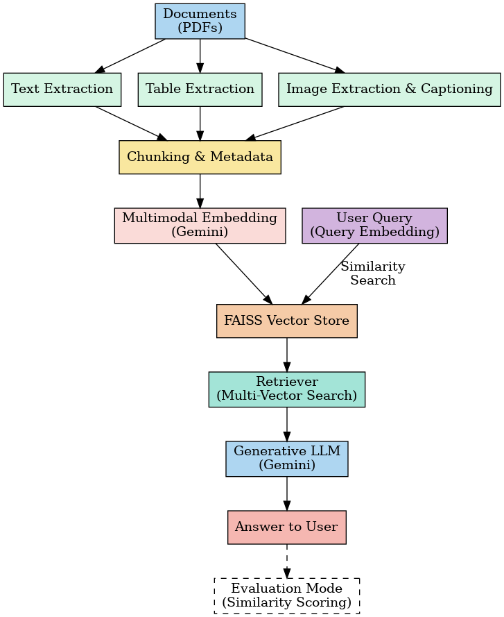
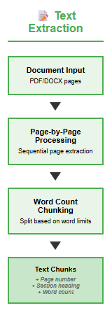
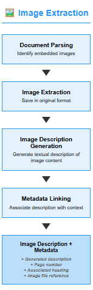
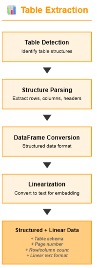
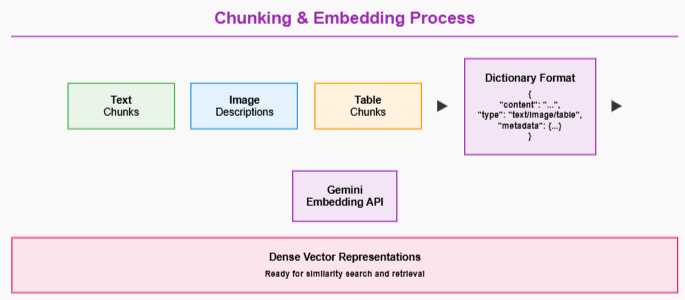
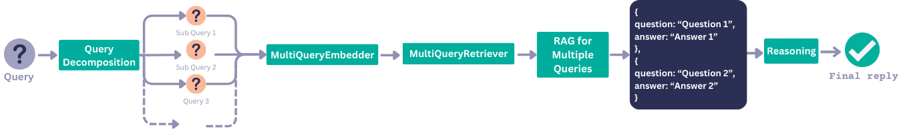
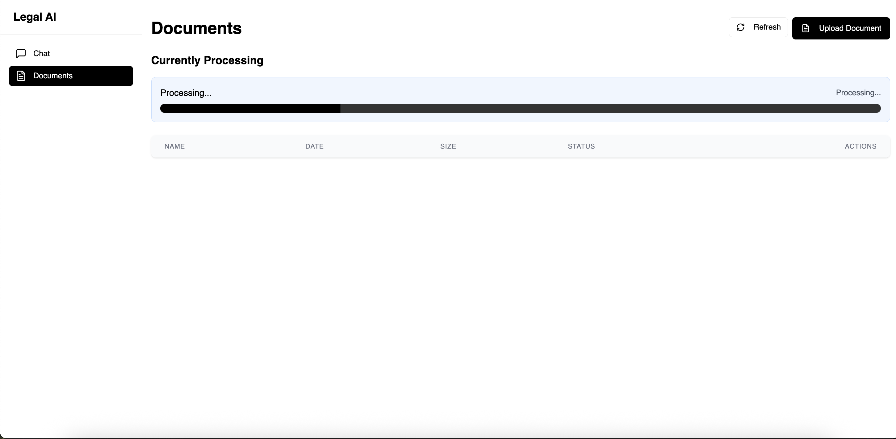
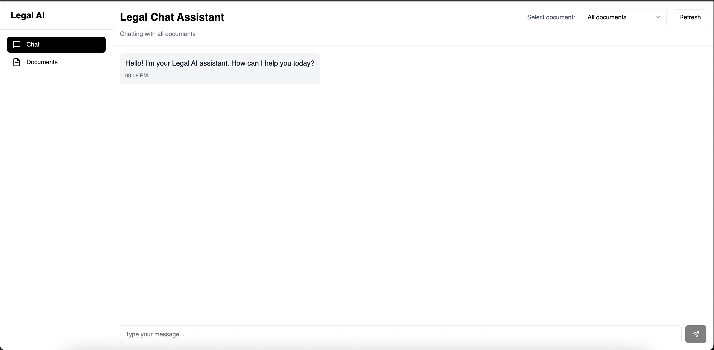

# Legal RAG - Multimodal PDF RAG System

A complete Retrieval-Augmented Generation (RAG) system that processes PDFs to extract text, images, and tables, then allows you to ask questions about the content using natural language.



## Features

- **Text Extraction**: Extracts and chunks text from PDF pages



- **Image Processing**: Extracts images and generates captions using Gemini Vision



- **Table Extraction**: Extracts tables and converts them to structured format



- **Semantic Search**: Uses sentence transformers for embedding and Pinecone for vector search



- **Query Decomposition**: Breaks complex multi-part questions into simpler sub-queries and answers them iteratively



- **Multimodal QA**: Answers questions based on a combination of text, image, and table content

- **Image Rendering in Answers**: Automatically displays relevant extracted images alongside generated answers for visual context

- **Web Interface**: User-friendly API interface with FastAPI

## Architecture

The system follows a modular architecture with distinct processing stages:

1. **PDF Upload & Processing**
   - Text extraction with intelligent chunking
   - Image extraction and cloud storage
   - Table detection and structuring

2. **AI Enhancement**
   - Image captioning using Gemini Vision
   - Content embedding generation
   - Vector storage in Pinecone

3. **Query Processing**
   - Query decomposition for complex questions
   - Semantic similarity search
   - Context reranking

4. **Response Generation**
   - Sub-query answer synthesis
   - Final answer composition
   - Source attribution

## Setup

### Prerequisites

- Python 3.9 or higher
- Pinecone API account
- Google Gemini API key
- Azure Storage account (for image storage)

### Installation Steps

1. **Clone the repository**
   ```bash
   git clone <repository-url>
   cd Legal_RAG
   ```

2. **Install dependencies**
   ```bash
   pip install -r requirements.txt
   ```

3. **Configure environment variables**

   Create a [.env](.env) file in the project root:
   ```env
   # Pinecone Configuration
   PINECONE_API_KEY=your_pinecone_api_key
   PINECONE_INDEX_NAME=your_index_name
   PINECONE_ENVIRONMENT=your_environment

   # Google Gemini API
   GOOGLE_API_KEY=your_gemini_api_key

   # Azure Storage (for images)
   AZURE_STORAGE_CONNECTION_STRING=your_connection_string
   AZURE_CONTAINER_NAME=your_container_name
   ```

4. **Get API Keys**
   - **Pinecone**: Sign up at [pinecone.io](https://www.pinecone.io/) and create an index
   - **Google Gemini**: Get your API key from [Google AI Studio](https://makersuite.google.com/app/apikey)
   - **Azure Storage**: Create a storage account in [Azure Portal](https://portal.azure.com/)

5. **Run the application**
   ```bash
   python app.py
   ```

6. **Open your browser**
   - Go to [http://localhost:8000](http://localhost:8000)
   - API Documentation: [http://localhost:8000/docs](http://localhost:8000/docs)
   - Upload PDF files and start asking questions!

## Usage

### Quick Start

1. **Upload PDFs**: Upload one or more PDF files via the API or web interface



2. **Process**: The system automatically extracts and indexes content (text, images, tables)

3. **Ask Questions**: Type questions about your documents in natural language

4. **Get Answers**: The system retrieves relevant content and generates comprehensive answers with images



### API Usage

Start the server:
```bash
python app.py
```

The API will be available at `http://localhost:8000`

**Interactive API Documentation:**
- **Swagger UI**: [http://localhost:8000/docs](http://localhost:8000/docs)
- **ReDoc**: [http://localhost:8000/redoc](http://localhost:8000/redoc)

### API Endpoints

#### 1. Upload PDF

```bash
curl -X POST "http://localhost:8000/upload" \
  -F "file=@document.pdf"
```

**Response** (small files < 5MB):
```json
{
  "message": "PDF 'document' processed and stored successfully",
  "pdf_name": "document",
  "cached": false,
  "chunks_processed": 156,
  "text_chunks": 142,
  "image_chunks": 14,
  "processing_duration": "23.45s",
  "status": "newly_processed"
}
```

**Response** (large files > 5MB):
```json
{
  "job_id": "uuid-here",
  "message": "Large file processing started",
  "status": "started",
  "requires_polling": true,
  "check_status_url": "/status/uuid-here",
  "file_size_mb": "12.3"
}
```

#### 2. Check Processing Status

```bash
curl "http://localhost:8000/status/{job_id}"
```

**Response**:
```json
{
  "job_id": "uuid-here",
  "filename": "document.pdf",
  "status": "processing",
  "stage": "Captioning 45 images",
  "progress": 0.6,
  "elapsed_time": "15.23s"
}
```

#### 3. Query Documents

```bash
curl -X POST "http://localhost:8000/query" \
  -H "Content-Type: application/json" \
  -d '{
    "query": "What are the key terms of the contract?",
    "pdf_name": "contract"
  }'
```

**Response**:
```json
{
  "answer": "The key terms of the contract include...",
  "images": [
    {
      "url": "https://storage.url/image1.png",
      "page": 3,
      "caption": "Contract signature section"
    }
  ],
  "sources": [
    {
      "type": "text",
      "page": 2,
      "content_preview": "Section 3.1: Payment Terms..."
    }
  ]
}
```

## Core Components

### PDF Processor ([utils/pdf_processor.py](utils/pdf_processor.py))
- Extracts text using PyPDF2 and PyMuPDF
- Chunks text into semantic segments
- Extracts images and uploads to Azure Storage
- Handles multi-page documents efficiently

### Image Captioner ([utils/image_captioner.py](utils/image_captioner.py))
- Uses Google Gemini Vision API
- Generates descriptive captions for images
- Supports batch processing with async operations
- Extracts visual context from charts, diagrams, and photos

### Vector Store ([utils/vector_store.py](utils/vector_store.py))
- Manages Pinecone vector database operations
- Stores and retrieves embeddings
- Implements caching to avoid reprocessing
- Supports filtered search by PDF name

### Query Processor ([utils/query_processor.py](utils/query_processor.py))
- Decomposes complex queries into sub-queries
- Reranks results based on relevance
- Optimizes retrieval accuracy

### Response Generator ([utils/response_generator.py](utils/response_generator.py))
- Generates answers using Google Gemini
- Combines multiple sub-query results
- Provides coherent, context-aware responses
- Includes source attribution

## Advanced Features

### Smart Caching

The system automatically checks if a PDF has been processed before:
- **Cache Hit**: Returns existing data instantly
- **Cache Miss**: Processes the PDF and stores in vector database
- Saves processing time and API costs

### Query Decomposition

Complex questions are broken down automatically:
```
Query: "What are the payment terms and liability clauses?"
↓
Sub-queries:
1. "What are the payment terms?"
2. "What are the liability clauses?"
```

### Background Processing

Large files (>5MB) are processed asynchronously:
1. Upload returns immediately with a `job_id`
2. Client polls `/status/{job_id}` for progress
3. Receive notification when processing completes

## Development

### Running in Development Mode

```bash
uvicorn app:app --reload --host 0.0.0.0 --port 8000
```

### Docker Deployment

```bash
docker build -t legal-rag .
docker run -p 8000:8000 --env-file .env legal-rag
```

## Performance Considerations

- **File Size Limits**: 50MB per PDF
- **Processing Time**:
  - Small PDFs (<5MB): 10-30 seconds
  - Large PDFs (>5MB): 30-120 seconds
- **Concurrent Requests**: Supports multiple simultaneous uploads
- **Caching**: Subsequent queries on same PDF are near-instant

---

**Built with ❤️ for intelligent document processing**
